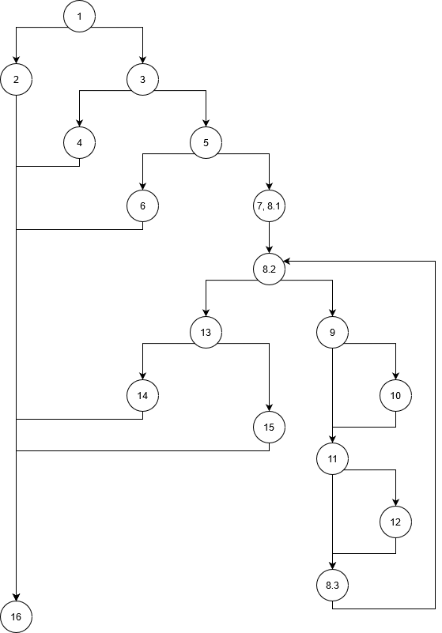

# Втора лабораториска вежба по Софтверско инженерство

## Стефан Васовски, бр. на индекс 185034

### Група на код: 2

###  Control Flow Graph

### Цикломатска комплексност

Цикломатската комплексност е еднаква со бројот на региони, во овој граф се 8 па цикломатската комплексност изнесува 8.

### Тест случаи според критериумот Every statement

    Тест 1 user: null, allUsers: null
    Јазли 1, 2, 16
    
    Тест 2 user: new User(null, null, null), allUsers: null
    Јазли 1, 3, 4, 16
            
    Тест 3 user: new User("185034", "password", null), allUsers: new ArrayList<>()
    Јазли 1, 3, 5, 6, 16
           
    Тест 4 user: new User("185034", "password", ""), allUsers: new ArrayList<>()
    Јазли 1, 3, 5, 7, 8.1, 8.2, 13, 14, 16
                   
    Тест 5 user: new User("185034", "password", "stefan.vasovski@students.finki.ukim.mk"), allUsers: new ArrayList<>()
    Јазли 1, 3, 5, 7, 8.1, 8.2, 8.3, 9, 10, 11, 12, 13, 15, 16

### Тест случаи според критериумот Every path
    
    Патека 1, 2, 16
    user: null, allUsers: null
    
    Патека 1, 3, 4, 16
    user: new User(null, null, null), allUsers: null
    
    Патека 1, 3, 5, 6, 16
    user: new User("185034", "password", null), allUsers: new ArrayList<>()
    
    Патека 1, 3, 5, 7, 8.1, 8.2, 13, 14, 16
    user: new User("185034", "password", ""), allUsers: new ArrayList<>()
    
    (1) Патека 1, 3, 5, 7, 8.1, 8.2, 13, 15, 16 не е можна
    
    Патека 1, 3, 5, 7, 8.1, (8.2, 9, 11, 8.3), 13, 14, 16
    user: new User("185034", "password", "asd"), allUsers: new ArrayList<>()
    
    (2) Патека 1, 3, 5, 7, 8.1, (8.2, 9, 11, 8.3), 13, 15, 16 не е можна
    
    Патека 1, 3, 5, 7, 8.1, (8.2, 9, 10, 11, 8.3), 13, 14, 16
    user: new User("185034", "password", "@"), allUsers: new ArrayList<>()
    
    (3) Патека 1, 3, 5, 7, 8.1, (8.2, 9, 10, 11, 8.3), 13, 15, 16 не е можна
    
    Патека 1, 3, 5, 7, 8.1, (8.2, 9, 11, 12, 8.3), 13, 14, 16
    user: new User("185034", "password", "."), allUsers: new ArrayList<>()
    
    (4) Патека 1, 3, 5, 7, 8.1, (8.2, 9, 11, 12, 8.3), 13, 15, 16 не е можна
    
    (5) Патека 1, 3, 5, 7, 8.1, (8.2, 9, 10, 11, 12, 8.3), 13, 14, 16 не е можна
    
    (6) Патека 1, 3, 5, 7, 8.1, (8.2, 9, 10, 11, 12, 8.3), 13, 15, 16 не е можна
    
    Патека 1, 3, 5, 7, 8.1, (mixed), 13, 14, 16
    new User("185034", "password", "asd@@@"), allUsers: new ArrayList<>()
    
    Патека 1, 3, 5, 7, 8.1, (mixed), 13, 15, 16
    user: new User("185034", "password", "stefan.vasovski@students.finki.ukim.mk"), allUsers: new ArrayList<>()

### Објаснување на напишаните unit tests

Во методата за тестирање every statement потребно е да се изминат сите линии код со користење на test case-ови.
Минималниот број на test case-ови за оваа метода го претпоставив од бројот на терминирачки јазли.
Влезовите на test case-овити ги одредив така што следејќи ја патеката, ги поставив влезовите да одговараат на условите
на предикатните јазли. Пример влезот за тест 1 го поставив да ги помине јазлите 1, 2, 16. Јазолот 1 е предикатен каде 
условот за False е user да биде null а вредноста на allUsers е небитна. Со дебагирање каде breakpoints 
се сите јазли, ја пополнив табелата и ја потврдив точноста на unit тестот.

Јазел | Тест 1 | Тест 2 | Тест 3 | Тест 4 | Тест 5
---|:---:|:---:|:---:|:---:|:---:
1  | * | * | * | * | * 
2  | * |   |   |   | 
3  |   | * | * | * | *
4  |   | * |   |   |		
5  |   |   | * | * | *
6  |   |   | * |   |	
7  |   |   |   | * | *
8.1|   |   |   | * | *
8.2|   |   |   | * | *
8.3|   |   |   |   | *
9  |   |   |   |   | *
10 |   |   |   |   | *
11 |   |   |   |   | *
12 |   |   |   |   | *
13 |   |   |   | * | *
14 |   |   |   | * |
15 |   |   |   |   | *
16 | * | * | * | * | *

Со методата за тестирање every path потребно е да се поминат сите патеки. Патеките ги одредив со помош на графот 
истоштувајќи ги сите можности во јазлите со гранење. Слично како и кај every statement вредностите за влезовите 
ги одредив од условите на предикатните јазли, но овде секоја патека не беше возможна да се тестира. Првите 4 
патеки се не возможни бидејќи го задоволуваат условот во јазел 13, за условот да не биде точен потребно е да се постават 
или една од променливите(Патека 3, 4) во јазел 10 и 12 или пак и двете(Патека 1, 2), но тоа пак претставува сосема друга патека.
Патека 5 и 6 се невозможни бидејќи карактерот не може да ги задоволува и двата услови.
Точноста на unit тестот го потврдив со дебагирање споредувајќи ја точната(саканата) со кодираната патека.
